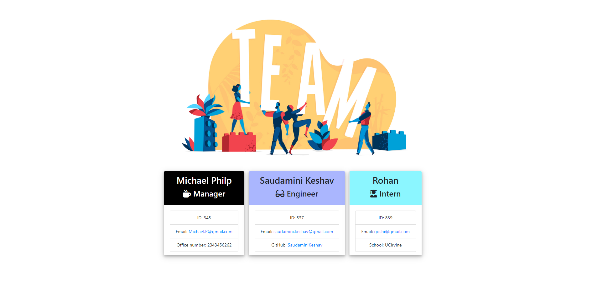

# Team Profile Summary Generator

# Unit 10 OOP Homework: Template Engine - Employee Summary

One of the most important aspects of programming is writing code that is readable, reliable, and maintainable. Oftentimes, *how* we design our code is just as important as the code itself. In this homework assignment, your challenge is to build a Node CLI that takes in information about employees and generates an HTML webpage that displays summaries for each person. Since testing is a key piece in making code maintainable, you will also be ensuring that all unit tests pass.


## Instructions

You will build a software engineering team generator command line application. The application will prompt the user for information about the team manager and then information about the team members. The user can input any number of team members, and they may be a mix of engineers and interns. This assignment must also pass all unit tests. When the user has completed building the team, the application will create an HTML file that displays a nicely formatted team roster based on the information provided by the user. Following the [common templates for user stories](https://en.wikipedia.org/wiki/User_story#Common_templates), we can frame this challenge as follows:

```
As a manager
I want to generate a webpage that displays my team's basic info
so that I have quick access to emails and GitHub profiles
```

How do you deliver this? Here are some guidelines:

* Use the [Inquirer npm package](https://github.com/SBoudrias/Inquirer.js/) to prompt the user for their email, id, and specific information based on their role with the company. For instance, an intern may provide their school, whereas an engineer may provide their GitHub username.

* Your app will run as a Node CLI to gather information about each employee.

* Below is an example of what the application looks like and also the GIF of how thw CLI application can be used to generate the below webpage.




In the `Develop` folder, there is a `package.json`, so make sure to `npm install`.

The dependencies are, [jest](https://jestjs.io/) for running the provided tests, and [inquirer](https://www.npmjs.com/package/inquirer) for collecting input from the user.

There are also unit tests to help you build the classes necessary.

It is recommended that you follow this workflow:

1. Run tests
2. Create or update classes to pass a single test case
3. Repeat

🎗 Remember, you can run the tests at any time with `npm run test`

It is recommended that you start with a directory structure that looks like this:

```
lib/           // classes and helper code
output/        // rendered output
templates/     // HTML template(s)
test/          // jest tests
  Employee.test.js
  Engineer.test.js
  Intern.test.js
  Manager.test.js
app.js         // Runs the application
```

### Hints

* Create multiple HTML templates for each type of user. For example, you could use the following templates:

  * `main.html`

  * `engineer.html`
  
  * `intern.html`
  
  * `manager.html`

* You will want to make your methods as pure as possible. This means try to make your methods simple so that they are easier to test.

* The different employee types should all inherit some methods and properties from a base class of `Employee`.

* In your HTML template files, you may want to add a placeholder character that helps your program identify where the dynamic markup begins and ends.

## Minimum Requirements

* Functional application.

* GitHub repository with a unique name and a README describing the project.

* User can use the CLI to generate an HTML page that displays information about their team.

* All tests must pass.

### Classes
The project must have the these classes: `Employee`, `Manager`, `Engineer`,
`Intern`. The tests for these classes in the `tests` directory must all pass.

The first class is an `Employee` parent class with the following properties and
methods:

  * name
  * id
  * email
  * getName()
  * getId()
  * getEmail()
  * getRole() // Returns 'Employee'

The other three classes will extend `Employee`. 

In addition to `Employee`'s properties and methods, `Manager` will also have:

  * officeNumber

  * getRole() // Overridden to return 'Manager'

In addition to `Employee`'s properties and methods, `Engineer` will also have:

  * github  // GitHub username

  * getGithub()

  * getRole() // Overridden to return 'Engineer'

In addition to `Employee`'s properties and methods, `Intern` will also have:

  * school 

  * getSchool()

  * getRole() // Overridden to return 'Intern'

### User input

The project must prompt the user to build an engineering team. An engineering
team consists of a manager, and any number of engineers and interns.

### Roster output

The project must generate a `team.html` page in the `output` directory, that displays a nicely formatted team roster. Each team member should display the following in no particular order:

  * Name

  * Role

  * ID

  * Role-specific property (School, link to GitHub profile, or office number)

## Bonus

* Use validation to ensure that the information provided is in the proper expected format.

* Add the application to your portfolio.

## Commit Early and Often

One of the most important skills to master as a web developer is version control. Building the habit of committing via Git is important for two reasons:

* Your commit history is a signal to employers that you are actively working on projects and learning new skills.

* Your commit history allows you to revert your codebase in the event that you need to return to a previous state.

Follow these guidelines for committing:

* Make single-purpose commits for related changes to ensure a clean, manageable history. If you are fixing two issues, make two commits.

* Write descriptive, meaningful commit messages so that you and anyone else looking at your repository can easily understand its history.

* Don't commit half-done work, for the sake of your collaborators (and your future self!).

* Test your application before you commit to ensure functionality at every step in the development process.

We would like you to have well over 200 commits by graduation, so commit early and often!


## Submission on BCS

You are required to submit the following:

* The URL of the GitHub repository

* A video demonstrating the entirety of the app's functionality 

- - -
© 2019 Trilogy Education Services, a 2U, Inc. brand. All Rights Reserved.


Team Employee Summary - Template Engine: OOP, Node, & ES6
Application Description
This application is a Node command line application that takes in information about team members & employees of a software engineering team and generates an HTML webpage that displays summaries for each team member.

One of the most important aspects of programming is writing code that is readable, reliable, and maintainable. Often times, how we design our code is just as important as the code itself. Since testing is a key piece in making code maintainable, this application also includes a suites of Jest unit tests. And the development of this project was focused on test-driven development.

The live page can be viewed on GitHub Pages here: https://connietran-dev.github.io/team-page-generator/index.html

Generated team webpage

Usage
User input
This Node CLI will prompt you to generate a webpage for your software engineering team. The application will prompt you for information about the team manager and then information about the team members. You can input any number of team members, including a mix of engineers and interns. Validation is implemented to ensure that information provided is in the proper expected format.

Gif demo of team-page-generator CLI

Roster output
When you have completed building the team, the application then generates an index.html page in the docs/ directory, that displays a nicely formatted team roster based on the information you provided. Each team member displays the following:

Name
Role
ID
Role-specific property (office number, link to GitHub profile, or university)
Installation
To generate your own HTML team page, first download the repository and run npm install in order to install the following npm package dependencies as specified in the package.json:

inquirer will prompt the user for the team member's email, id, and specific information based on their role with the company. For instance, an intern may provide their school, whereas an engineer may provide their GitHub username.
jest will run unit tests to ensure that the Employee, Manager, Engineer, and Intern objects are generated from their classes correctly.
Once you have npm install your dependencies, you can run the Node CLI application with npm start which will begin the questions about your engineering team. You can run the tests at any time with npm test.

Methodology
Directory Structure
The directory structure of the application is as follows:

docs/          // Rendered HTML output that will appear on GitHub pages
lib/           // Employee classes as well as helper code to generate HTML
templates/     // Templates for main HTML <body> and employee <div>s
test/          // Jest tests
questions.js   // Inquirer prompts
app.js         // Runs the application and main functions
The templates/ directory contains the main.html template for the main <head> and <body> as well as multiple HTML templates with placeholder characters that are identified with Regex for where dynamic markup begins and ends for each type of employee:

engineer.html

intern.html

manager.html

Classes
This application utilizes JavaScript's brand of object-oriented programming by using constructors, the prototype chain, and the ES6 pattern of class.

The different employee types, Manager, Engineer, and Intern, inherit methods and properties from a base class of Employee.

The first class is an Employee parent class with the following properties and methods:

name
id
email
role
getName()
getId()
getEmail()
getRole() // Returns 'Employee'
The other three classes extend Employee. In addition to Employee's properties and methods, Manager also has:

officeNumber
getRole() // Overridden to return 'Manager'
In addition to Employee's properties and methods, Engineer also has:

github // GitHub username
getGithub()
getRole() // Overridden to return 'Engineer'
In addition to Employee's properties and methods, Intern also has:

school
getSchool()
getRole() // Overridden to return 'Intern'
Test-Driven Development (TDD)
The development of this application focused on writing tests and ensuring application features passed to ensure code was understandable and maintainable. The methods on the classes were also developed to be as simple and pure as possible so that they are easier to test. The suite of Jest tests for the above classes in the tests/ directory currently pass. Ultimately, these tests serve as fail-safes for future maintenance of the code base.

Original Comps
Below were the original comps that mocked up what the application might look like.

Employee Summary 1 Employee Summary 2
